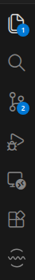
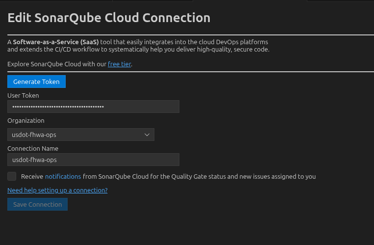
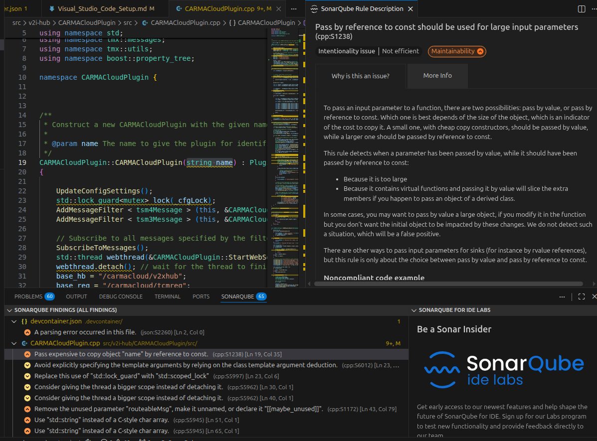

# SonarLint VS Code Setup

## Overview

[Visual Studio Code](https://code.visualstudio.com/) is a free IDE that works well for its-telematics development. This guide covers setting up SonarLint for real-time code quality feedback against the its-telematics SonarCloud project.

SonarLint runs in VS Code and flags code smells, bugs, and security issues as you type, using the same rules that SonarCloud applies during CI. This shortens the feedback loop between writing code and catching issues.

## Installation

You will need:

- VS Code installed - https://code.visualstudio.com/download
- Access to the [usdot-fhwa-stol SonarCloud organization](https://sonarcloud.io/organizations/usdot-fhwa-stol)

## Recommended VS Code Extensions

This repo includes a `.vscode/extensions.json` file that recommends helpful extensions when you open the workspace. The main one is:

- **SonarLint** (`SonarSource.sonarlint-vscode`) - code quality and linting tool that provides feedback on best practices and security issues. Connected to the its-telematics SonarCloud project so findings match what runs in CI.

When you open the repo for the first time, VS Code will prompt you to install recommended extensions. Accept the prompt, or install SonarLint manually from the Extensions panel.

## SonarLint One-Time Setup

The first time setting up SonarLint, there are a couple of VS Code prompts to navigate to enable Connected Mode against SonarCloud. After installing the extension, you should see a new icon on the sidebar representing the SonarLint VS Code extension.

Clicking this icon brings up the SonarQube Setup page. Under **Connected Mode** there should be a **SonarQube Cloud** menu. Clicking this provides a connection page that lets you generate a token for a SonarQube Cloud connection. This provides additional features such as inheriting Quality Profiles set on SonarCloud.

Click **Generate Token**, which opens a browser and lets you sign in to SonarCloud with your GitHub account. Doing so grants the VS Code extension a token to connect to SonarCloud.

Set the connection details as follows:

- **Connection ID**: `SonarCloud Connection`
- **Organization Key**: `usdot-fhwa-stol`

The **Connection ID** must match exactly. The workspace `.vscode/settings.json` references this name to bind the project to the `usdot-fhwa-stol_ns3-federate` SonarCloud project.

> Note: Please ensure you save the connection after generating the token. Sometimes the **Save Connection** button is greyed out, but resetting the organization or connection name should allow you to save the connection.

## Confirming Setup Was Successful

After saving the connection, open a `.js`, `.ts`, `.java`, or `.py` file and edit it. This should result in code smells reported in both the code editor and in the SonarLint panel.

Using **Ctrl + I** generates AI-recommended fixes for reported issues where applicable (requires GitHub sign-in).

## Language Coverage

With Connected Mode enabled, SonarLint analyzes the following languages locally in VS Code:

- JavaScript
- TypeScript
- Java
- Python
- Go

Shell scripts are not analyzed by SonarLint locally. Shell files are still checked by SonarCloud during CI if a shell analyzer is configured at the project level.

## Troubleshooting

- **No issues showing up:** Confirm SonarLint is signed in to SonarCloud (check the SonarLint status in the bottom-right of VS Code). Confirm the Connection ID matches `SonarCloud Connection` exactly.
